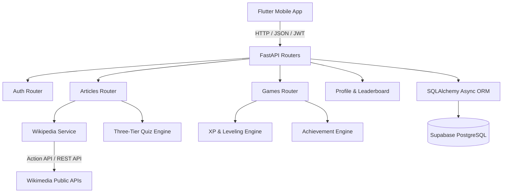

# Wiki Roulette — System Architecture

## Overview

Wiki Roulette is structured as a decoupled client-server architecture:
- **FastAPI Backend**: Acts as the business logic, scoring calculation, question generation, and database mediation layer.
- **Supabase PostgreSQL**: Hosted database storing persistent game history, user state, achievements, and question caches.
- **Flutter Mobile Client**: Native reactive UI built with Material 3 dark glassmorphism, Riverpod state management, and GoRouter declarative navigation.
- **Wikimedia Official APIs**: Official MediaWiki Action API (`rnnamespace=0`) and Wikipedia REST Summary API.

---

## 1. Backend Service Layer Architecture

---

## 2. Three-Tier Quiz Generation Strategy

To ensure zero hallucinations, zero fact fabrication, and sub-second response times, the quiz system operates in three tiers:

1. **Tier 1 — Seeded / Handcrafted**:
   - High-profile articles (e.g. Albert Einstein, Titanic, Alan Turing) have pre-written, verified questions and explanations.
2. **Tier 2 — DB Cache**:
   - When an article is requested that has previously been processed, existing questions are served immediately from PostgreSQL.
3. **Tier 3 — Deterministic Fact Extraction**:
   - For novel random articles, regex pattern extractors parse the article extract for unambiguous facts (e.g. 4-digit years, explicit quantities with units).
   - Distractors are derived via fixed mathematical offsets and static contextual pools (never hallucinated names).
   - **Quality Gate**: A minimum of 3 reliable questions is strictly required. If fewer than 3 can be generated without guessing, the article is flagged `quiz_available = False` and the roulette engine gracefully selects the next candidate.

---

## 3. Frontend Architecture

- **State Management**: `flutter_riverpod` (StateNotifierProvider, FutureProvider, StateProvider).
- **Navigation**: `go_router` supporting deep-linking, auth redirect guard, and bottom navigation shell routing.
- **Design System**:
  - Custom `AppColors` palette (OLED black, neon violet, cyan accents, glass borders).
  - Custom `AppTextStyles` built on Google Fonts Poppins.
  - Reusable `GlassCard`, `AtmosphericBackground`, and `XpProgressBar` widgets.
